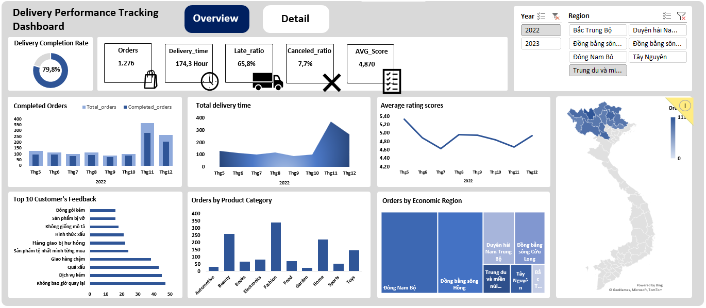
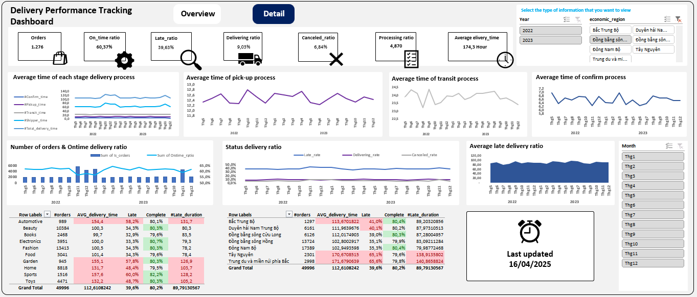

# Delivery Operations & SLA Performance Analytics — Excel

An operations analytics case study built entirely in **Microsoft Excel** to diagnose
delivery reliability, lifecycle status, process lead time, regional/category risk,
and peak-period performance across **49,996 orders**.

The project is positioned as an **Operations / Supply Chain / E-commerce analytics**
case—not just an Excel dashboard. The workbook converts order-level timestamps and
statuses into a standardized KPI layer, PivotTable analysis, and two interactive
management dashboards.

> **Period:** May 2022–December 2023  
> **Orders:** 49,996 unique orders  
> **Geography:** 62 provinces / 7 economic regions  
> **Products:** 10 categories / 70 products  
> **Network:** 999 sellers / 155 shippers / 9,928 customers  
> **Tool:** Microsoft Excel — Tables, formulas, PivotTables, PivotCharts, slicers, KPI cards

📊 [Excel workbook](Project.xlsx)  
📘 [KPI dictionary](docs/kpi-dictionary.md)  
🎯 [Operations priority framework](docs/operations-priority-framework.md)

---

## Executive Snapshot

The dashboard surfaces five operations signals:

1. **Lifecycle performance:** 40,077 orders were completed (**80.16%**), while
   6.84% were canceled and 12.99% remained in delivering/processing statuses.
2. **Delivery reliability:** among SLA-eligible delivered orders, the dashboard
   shows **60.37% on-time** and **39.63% late**, with **112.61 hours** average
   end-to-end delivery time.
3. **Lead-time concentration:** the shipper / final-mile stage averages **68.52
   hours**, approximately **60.8%** of the end-to-end delivery cycle.
4. **Risk is not one-dimensional:** Tây Nguyên and Trung du & miền núi phía Bắc
   show the highest SLA severity (~65% late and ~171-hour delivery), while high-volume
   regions such as Đông Nam Bộ generate greater absolute late-order exposure.
5. **Category priorities differ by severity vs scale:** Sports / Automotive / Garden
   show the highest late rates, but Fashion / Home / Beauty create more total
   exposure because their order volumes are much larger.

The key management question therefore becomes:

> **Where should operations prioritize process improvement when both failure rate
> and business volume matter?**

---

## Dashboard Preview

### Overview



### Detail



---

## Business Questions

The workbook is designed to answer:

1. What share of all orders are completed, canceled, delivering, or processing?
2. Of orders with a measurable delivery outcome, what share are on time vs late?
3. Which stage consumes the largest share of end-to-end delivery time?
4. Which regions combine severe SLA failure with meaningful order volume?
5. Which product categories have high late rates, and which create the largest
   absolute late-order exposure?
6. Do peak-volume periods coincide with weaker operational performance?
7. Which customer-feedback themes should be connected back to operational failure
   modes?

---

## Dataset & Analytical Grain

The dataset contains **49,996 unique order IDs** from May 2022 through December 2023.

| Dimension | Coverage |
| --- | ---: |
| Orders | 49,996 |
| Raw columns | 24 |
| Final columns | 37 |
| Engineered analytical columns | 13 |
| Provinces | 62 |
| Economic regions | 7 |
| Product categories | 10 |
| Products | 70 |
| Sellers | 999 |
| Customers | 9,928 |
| Shippers | 155 |
| Customer reviews | 18,022 |

The analytical grain is **one order per row**.

Missing timestamps are not automatically replaced with zero because a blank often
represents a valid lifecycle state—for example, a canceled order should not be
treated as having zero delivery time.

---

## Excel Architecture

The workbook demonstrates an Excel-native analytics workflow:

```text
Raw order-level data
        ↓
Data validation
        ↓
Excel Table + structured-reference formulas
        ↓
13 operational flags / duration fields
        ↓
~30 PivotTables
        ↓
PivotCharts + slicers
        ↓
Overview & Detail dashboards
```

### Excel features demonstrated

- Excel Tables
- structured-reference formulas
- date/time arithmetic
- `IF` / `ISBLANK`
- binary status flags
- PivotTables
- PivotCharts
- slicers
- KPI cards
- interactive filtering
- operations-focused dashboard layout

Example documented delivery-time formula:

```excel
=IF(
    ISBLANK(data[[#This Row],[delivery_time]]),
    "",
    (data[[#This Row],[delivery_time]]
    -data[[#This Row],[purchase_time]])*24
)
```

The blank-preserving logic is important: incomplete orders should not enter average
delivery time as zero-hour deliveries.

---

## Engineered Operations Fields

The workbook adds 13 analytical fields:

- `total_delivery_time`
- `Is_orders`
- `Is_canceled`
- `Is_late`
- `Is_on_time`
- `Is_delivering`
- `Is_processing`
- `Is_completed`
- `confirm_time`
- `pickup_time`
- `transit_time`
- `shipper_time`
- `late_duration`

Binary indicators make status metrics easy to aggregate through PivotTables, while
stage-duration fields support bottleneck analysis.

---

## Standardized KPI Logic

A major principle of the rebuild is to **separate lifecycle-status KPIs from
delivery-SLA KPIs**.

### Lifecycle KPIs — denominator = Total Orders

| KPI | Count | Rate |
| --- | ---: | ---: |
| Completed | 40,077 | 80.16% |
| Canceled | 3,422 | 6.84% |
| Delivering | 4,515 | 9.03% |
| Processing | 1,982 | 3.96% |
| **Total** | **49,996** | **100%** |

### Delivery SLA KPIs — denominator = SLA-eligible delivered orders

| KPI | Result |
| --- | ---: |
| On-Time Delivery Rate | 60.37% |
| Late Delivery Rate | 39.63% |
| Avg End-to-End Delivery Time | 112.61 h / 4.69 d |
| Avg Late Duration | ~89.79 h |

For the same filter context:

```text
On-Time Rate + Late Rate ≈ 100%
```

Canceled or still-processing orders should not be included in this SLA denominator.

See the full [KPI dictionary](docs/kpi-dictionary.md).

---

# Key Findings

## 1. Final mile is the largest observed lead-time component

| Delivery stage | Avg time | Share of total |
| --- | ---: | ---: |
| Confirmation | 6.51 h | 5.8% |
| Pickup preparation | 12.49 h | 11.1% |
| Transit | 25.09 h | 22.3% |
| Shipper / final mile | 68.52 h | 60.8% |
| **End-to-end** | **112.61 h** | **100%** |

The final-mile stage accounts for approximately **61%** of end-to-end delivery time.

### Operations interpretation

This is the largest time pool to investigate first.

It does **not** prove that shipper capacity is the root cause. A stronger operational
diagnostic would compare shipper, route, region, volume, final-mile time, late rate,
and late duration together.

---

## 2. Regional risk must be viewed through both severity and volume

### SLA-severity hotspots

| Region | Orders | Avg Delivery | Late Rate | Avg Late Duration |
| --- | ---: | ---: | ---: | ---: |
| Northern Midlands & Mountains | 2,998 | ~171.7 h | 65.6% | ~140.7 h |
| Central Highlands | 2,301 | ~170.7 h | 65.1% | ~138.9 h |
| North Central Coast | 1,297 | ~113.7 h | 41.0% | ~89.2 h |
| South Central Coast | 6,161 | ~112.0 h | 40.1% | ~88.0 h |
| Mekong River Delta | 6,126 | ~112.0 h | 39.0% | ~87.3 h |
| Southeast | 17,389 | ~102.9 h | 35.3% | ~80.0 h |
| Red River Delta | 13,724 | ~102.8 h | 35.1% | ~83.1 h |

The two severe regions are far above the network late-rate baseline of **39.63%**.

### But severity is not the same as total operational impact

The Southeast and Red River Delta have much lower late rates, but they also have the
largest order volumes.

Using displayed rounded rates as a rough prioritization estimate:

```text
Late delivered orders
≈ Orders × Completion Rate × Late Rate
```

suggests approximately:

- **Southeast:** ~4.9k late delivered orders
- **Red River Delta:** ~3.8k
- **Northern Midlands & Mountains:** ~1.6k
- **Central Highlands:** ~1.2k

These are prioritization estimates—not replacements for direct row-level counts.

### Management implication

Use two regional workstreams:

**Severity reduction**

Target the ~65% late-rate regions with route/carrier diagnostics.

**Absolute late-volume reduction**

Target high-volume regions where even a smaller percentage improvement can remove
many late orders.

---

## 3. Product-category priorities also change when volume is included

### Severity view

| Category | Orders | Avg Delivery | Late Rate | Avg Late Duration |
| --- | ---: | ---: | ---: | ---: |
| Sports | 1,516 | 157.6 h | 60.0% | 128.2 h |
| Automotive | 989 | 154.4 h | 58.2% | 131.7 h |
| Garden | 945 | 155.1 h | 57.8% | 126.9 h |
| Toys | 4,471 | 132.2 h | 48.7% | 105.2 h |
| Home | 8,818 | 131.7 h | 48.4% | 103.7 h |
| Beauty | 10,384 | 100.3 h | 34.3% | 80.3 h |
| Fashion | 13,413 | 100.5 h | 34.3% | 78.2 h |
| Electronics | 3,951 | 100.0 h | 33.3% | 79.3 h |
| Food | 3,041 | 101.4 h | 34.3% | 78.4 h |
| Books | 2,466 | 99.7 h | 32.9% | 83.5 h |

Sports, Automotive, and Garden are the strongest **rate-severity signals**.

However, rough exposure estimates indicate that **Fashion, Home, and Beauty** may
generate more late deliveries in absolute volume.

### Management implication

Use a **Volume × Late Rate** priority matrix instead of ranking categories only by
percentage.

The current data does not support claiming that size, weight, or handling complexity
causes these category differences. Those are hypotheses requiring product/route data.

---

## 4. Peak volume coincides with weaker operational performance

High-volume periods identified in the analysis include:

- November 2022
- December 2022
- January 2023
- November 2023

During these periods, the project reports approximately:

| KPI | Peak periods | Network baseline |
| --- | ---: | ---: |
| Completion Rate | 78–79% | 80.16% |
| Cancellation Rate | ~9% | 6.84% |
| Avg Delivery Time | 120–124 h | 112.61 h |

This supports a **capacity-stress hypothesis**.

It does not prove that demand volume caused the deterioration.

### Management implication

Build a pre-peak capacity review and a weekly exception report comparing:

- order volume
- completion/cancellation
- late rate
- backlog status
- region
- category
- shipper

against historical peak baselines.

---

## 5. Customer feedback is useful but only partially observed

The dataset contains:

- **18,022 reviews**
- **5.08 / 10** average rating
- approximately **36.0% review coverage** relative to total orders

Common negative themes include:

- poor service
- slow delivery
- poor packaging
- damaged / broken products
- customers indicating they would not return

### Management implication

Treat these themes as diagnostic signals, not population-wide causal evidence.

A stronger next analysis should cross-tab feedback themes against:

- late vs on-time delivery
- late duration
- region
- category
- shipper

to determine whether complaints concentrate around specific operational failures.

---

# Evidence-Driven Action Plan

| Priority | Evidence | Operational action | Success KPI |
| --- | --- | --- | --- |
| Final mile | 68.52 h / 60.8% of lead time | build shipper/final-mile scorecard | stage time, late rate, late duration |
| Severe regions | ~65% late / ~171 h delivery | route & carrier diagnostic | late rate, avg late duration |
| High-volume regions | highest absolute late exposure | reduce late-order count at scale | late count + rate |
| Sports / Auto / Garden | ~58–60% late | targeted category/route investigation | category late rate |
| Fashion / Home / Beauty | high order-volume exposure | prioritize scalable process fixes | absolute late orders |
| Peak months | 120–124 h delivery / ~9% cancel | pre-peak capacity planning | lead time, cancel rate, backlog |
| Feedback | 36% review coverage | connect themes to SLA failure modes | rating/theme by SLA status |

See the full [Operations priority framework](docs/operations-priority-framework.md).

---

## Recommended Operations Scorecard

A future workbook iteration should rank region / category / shipper using both:

### Severity

- Late Delivery Rate
- Avg Late Duration
- Avg Delivery Time

### Exposure

- Delivered order volume
- Late order count

A practical priority view is:

```text
                         HIGH LATE RATE
                              ↑
       TARGETED DIAGNOSTIC    |    TOP PRIORITY
       low volume / high risk | high volume / high risk
                              |
LOW VOLUME  ←─────────────────┼─────────────────→ HIGH VOLUME
                              |
       MONITOR                |    SCALE EFFICIENCY
       low volume / low risk  | high volume / moderate risk
                              ↓
                         LOW LATE RATE
```

This avoids prioritizing only the highest percentage or only the largest volume.

---

## Analytical Limitations

### 1. SLA denominators must remain explicit

Lifecycle status rates and delivery SLA rates answer different questions and use
different eligible populations.

### 2. Stage-time concentration is not causal proof

The final-mile stage is the largest observed component, but the workbook does not
by itself explain *why* that stage is long.

### 3. Regional/category hypotheses need deeper operational data

Potential drivers such as product dimensions, route distance, carrier capacity, or
handling requirements are not established by the current dashboard.

### 4. Customer feedback has partial coverage

Only ~36% of total orders have observed reviews.

### 5. Peak-period analysis is observational

Higher volume coincides with weaker KPIs, but that does not establish demand volume
as the sole cause.

### 6. AOV currency is not documented in the repository

The current workbook reports an average order value of 2,521.65; a currency symbol
should only be added after source verification.

---

## Repository Structure

```text
delivery-performance-excel-dashboard/
├── README.md
├── Project.xlsx
├── dashboard_image/
│   ├── overview.png
│   └── detail.png
└── docs/
    ├── kpi-dictionary.md
    └── operations-priority-framework.md
```

---

## Skills Demonstrated

### Excel

- Excel Tables
- structured-reference formulas
- date/time calculations
- IF / ISBLANK logic
- PivotTables
- PivotCharts
- slicers
- KPI cards
- interactive dashboard design

### Operations Analytics

- lifecycle-status KPI design
- SLA denominator logic
- lead-time decomposition
- late-delivery analysis
- severity vs volume prioritization
- regional and category diagnostics
- peak-period monitoring
- customer-feedback linkage
- evidence → hypothesis → action → KPI framing

---

## Project Positioning

This project demonstrates how Excel can be used as an operational decision-support
tool—not only for reporting.

The analysis progresses from:

```text
Order status
    ↓
Delivery reliability
    ↓
Lead-time bottleneck
    ↓
Region / category severity
    ↓
Volume exposure
    ↓
Operational priority
    ↓
Measurable action
```

That makes it suitable for **Supply Chain, Operations, Logistics, E-commerce
Operations, Merchandise, and Data Analyst** roles where Excel remains a core
decision-making tool.
